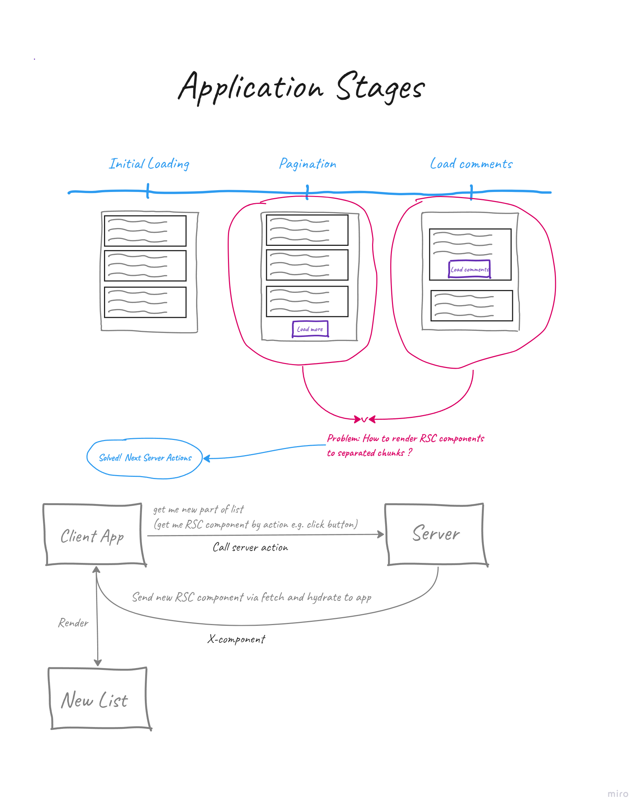

## Getting Started

First, run the development server:

```bash
npm run dev
```

Open [http://localhost:3000/posts](http://localhost:3000) with your browser to see the result.


## How it works


## Key points
### 1. Initial loading
For better web vitals, initial page loaded with first post list chunk. 
It allows to accept already rendered HTML file (see browser network);
### 2. Load next chunks
For loaded new chunks, client call server action and get new server components via fetch (Content-Type: x-component). The body response looks:

```text
0:["$@1",["goZ8WTRTQ0igqEotpS5lx",null]]
2:"$Sreact.suspense"
1:[["$","$2","16163970-8a3d-4073-b87a-f12a55984797",{"fallback":["$","article",null,{"className":"m-2 animate-pulse flex min-w-[600px] flex-col rounded-md border-solid border-2 border-border-blue bg-regal-blue p-2 text-white","children":[["$","h1",null,{"className":"h-4 bg-gray-200 rounded-full dark:bg-gray-700 w-80 mb-6"}],["$","p",null,{"className":"h-2 bg-gray-200 rounded-full dark:bg-gray-700 max-w-[480px] mb-3"}],["$","p",null,{"className":"h-2 bg-gray-200 rounded-full dark:bg-gray-700 max-w-[480px] mb-3"}],["$","p",null,{"className":"h-2 bg-gray-200 rounded-full dark:bg-gray-700 max-w-[480px] mb-5"}],["$","p",null,{"className":"w-full h-6 bg-gray-200 rounded-full dark:bg-gray-700"}]]}],"children":"$L3"}],5]
3:["$","div",null,{"children":["$L4","$L5","$L6","$L7","$L8"]}]
9:I[6926,["991","static/chunks/app/posts/page-c75502a49527038b.js"],"Comments"]
4:["$","article",null,{"className":"m-2 flex max-w-[600px] flex-col rounded-md border-solid border-2 border-border-blue bg-regal-blue p-2 text-white","children":[["$","h1",null,{"className":"pb-4 text-xl","children":"His mother had always taught him"}],["$","p",null,{"className":"pb-6 text-sm","children":"His mother had always taught him not to ever think of himself as better than others. He'd tried to live by this motto. He never looked down on those who were less fortunate or who had less money than him. But the stupidity of the group of people he was talking to made him change his mind."}],["$","$L9",null,{"id":1}]]}]
5:["$","article",null,{"className":"m-2 flex max-w-[600px] flex-col rounded-md border-solid border-2 border-border-blue bg-regal-blue p-2 text-white","children":[["$","h1",null,{"className":"pb-4 text-xl","children":"He was an expert but not in a discipline"}],["$","p",null,{"className":"pb-6 text-sm","children":"He was an expert but not in a discipline that anyone could fully appreciate. He knew how to hold the cone just right so that the soft server ice-cream fell into it at the precise angle to form a perfect cone each and every time. It had taken years to perfect and he could now do it without even putting any thought behind it."}],["$","$L9",null,{"id":2}]]}]
6:["$","article",null,{"className":"m-2 flex max-w-[600px] flex-col rounded-md border-solid border-2 border-border-blue bg-regal-blue p-2 text-white","children":[["$","h1",null,{"className":"pb-4 text-xl","children":"Dave watched as the forest burned up on the hill."}],["$","p",null,{"className":"pb-6 text-sm","children":"Dave watched as the forest burned up on the hill, only a few miles from her house. The car had been hastily packed and Marta was inside trying to round up the last of the pets. Dave went through his mental list of the most important papers and documents that they couldn't leave behind. He scolded himself for not having prepared these better in advance and hoped that he had remembered everything that was needed. He continued to wait for Marta to appear with the pets, but she still was nowhere to be seen."}],["$","$L9",null,{"id":3}]]}]
7:["$","article",null,{"className":"m-2 flex max-w-[600px] flex-col rounded-md border-solid border-2 border-border-blue bg-regal-blue p-2 text-white","children":[["$","h1",null,{"className":"pb-4 text-xl","children":"All he wanted was a candy bar."}],["$","p",null,{"className":"pb-6 text-sm","children":"All he wanted was a candy bar. It didn't seem like a difficult request to comprehend, but the clerk remained frozen and didn't seem to want to honor the request. It might have had something to do with the gun pointed at his face."}],["$","$L9",null,{"id":4}]]}]
8:["$","article",null,{"className":"m-2 flex max-w-[600px] flex-col rounded-md border-solid border-2 border-border-blue bg-regal-blue p-2 text-white","children":[["$","h1",null,{"className":"pb-4 text-xl","children":"Hopes and dreams were dashed that day."}],["$","p",null,{"className":"pb-6 text-sm","children":"Hopes and dreams were dashed that day. It should have been expected, but it still came as a shock. The warning signs had been ignored in favor of the possibility, however remote, that it could actually happen. That possibility had grown from hope to an undeniable belief it must be destiny. That was until it wasn't and the hopes and dreams came crashing down."}],["$","$L9",null,{"id":5}]]}]
```
The last four rows includes post which immediately hydrate to our react dom as components. For more details - [click](https://demystifying-rsc.vercel.app/)
### 3. Load chunks with query filter
See 2 section. The mechanism is same

## Conclusion
I found the little trick how subload new RSC components via interactive actions through Next Server Action. If you have idea how to improve code or other way to enforce RSC, you can open issue. 